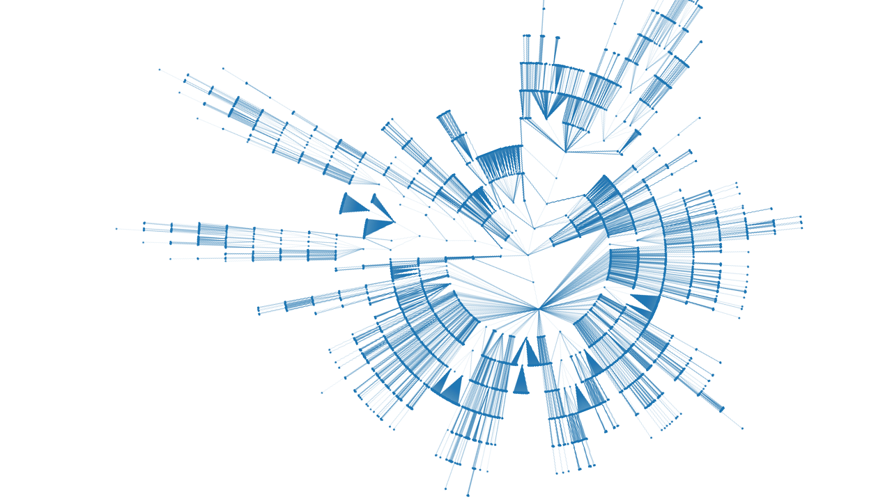

folderstats
===========

.. image:: https://img.shields.io/pypi/v/folderstats.svg
        :target: https://pypi.python.org/pypi/folderstats

This is a python module and command-line interface that creates statistics from a folder structure. It returns a `Pandas`_ dataframe from the folders and files from a selected folder.

Installation
------------

.. code-block:: bash

	pip install folderstats

Usage
-----

To get statistics of a folder structure as a Pandas dataframe in Python you can type:

.. code-block:: python

	import folderstats  
	df = folderstats.folderstats('.', hash_name='md5', ignore_hidden=True)
	df

+----+---------------------------+---------------+-----------+-------+---------------------+---------------------+---------------------+--------+-----------+-------+--------+------+----------------------------------+
| id | path                      | name          | extension | size  | atime               | mtime               | ctime               | folder | num_files | depth | parent | uid  | md5                              |
+====+===========================+===============+===========+=======+=====================+=====================+=====================+========+===========+=======+========+======+==================================+
| 3  | ./folderstats/__main__.py | __main__      | py        | 2596  | 2018-12-23 23:14:23 | 2018-12-23 23:14:22 | 2018-12-23 23:14:22 | False  |           | 1     | 2      | 1000 | 87446d672b598eda17161296ea333ecc |
+----+---------------------------+---------------+-----------+-------+---------------------+---------------------+---------------------+--------+-----------+-------+--------+------+----------------------------------+
| 4  | ./folderstats/__init__.py | __init__      | py        | 2790  | 2018-12-23 23:09:07 | 2018-12-23 23:09:05 | 2018-12-23 23:09:05 | False  |           | 1     | 2      | 1000 | 7b4adc532f304863423ec11afd3232ad |
+----+---------------------------+---------------+-----------+-------+---------------------+---------------------+---------------------+--------+-----------+-------+--------+------+----------------------------------+
| 2  | ./folderstats             | ./folderstats |           | 13802 | 2018-12-23 23:14:48 | 2018-12-23 23:14:48 | 2018-12-23 23:14:48 | True   | 2.0       | 1     | 2      | 1000 |                                  |
+----+---------------------------+---------------+-----------+-------+---------------------+---------------------+---------------------+--------+-----------+-------+--------+------+----------------------------------+
| 5  | ./README.rst              | README        | rst       | 4989  | 2018-12-23 22:17:25 | 2018-12-22 14:50:43 | 2018-12-22 14:50:43 | False  |           | 0     | 1      | 1000 | 3046052820c91c309412fbbb4a1f5d3c |
+----+---------------------------+---------------+-----------+-------+---------------------+---------------------+---------------------+--------+-----------+-------+--------+------+----------------------------------+
| 6  | ./LICENSE                 | LICENSE       |           | 1073  | 2018-12-23 22:34:16 | 2018-12-22 14:50:43 | 2018-12-22 14:50:43 | False  |           | 0     | 1      | 1000 | 1232cbd9eced47e27816f69740ad479d |
+----+---------------------------+---------------+-----------+-------+---------------------+---------------------+---------------------+--------+-----------+-------+--------+------+----------------------------------+
| 7  | ./setup.py                | setup         | py        | 1975  | 2018-12-23 22:50:10 | 2018-12-23 22:50:09 | 2018-12-23 22:50:09 | False  |           | 0     | 1      | 1000 | b5410458c1334a753c4dd71db0f337d2 |
+----+---------------------------+---------------+-----------+-------+---------------------+---------------------+---------------------+--------+-----------+-------+--------+------+----------------------------------+
| 1  | .                         | .             |           | 21022 | 2018-12-23 23:16:26 | 2018-12-23 23:16:26 | 2018-12-23 23:16:26 | True   | 5.0       | 0     | 0      | 1000 |                                  |
+----+---------------------------+---------------+-----------+-------+---------------------+---------------------+---------------------+--------+-----------+-------+--------+------+----------------------------------+ 

You can use the same functionality as a command-line interface which can generate files (CSV or JSON) or print the statistics directly into the command line:

.. code-block:: bash

	folderstats . -c md5 -i -o stats.csv

In order to see the other available arguments type:

.. code-block:: bash

	folderstats --help

License 
-------

This project is licensed under the MIT license. See the `LICENSE`_ for details.

.. _Pandas: http://pandas.pydata.org/
.. _LICENSE: LICENSE
